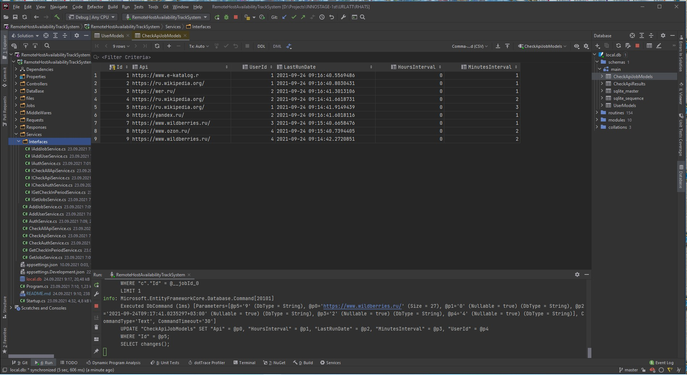
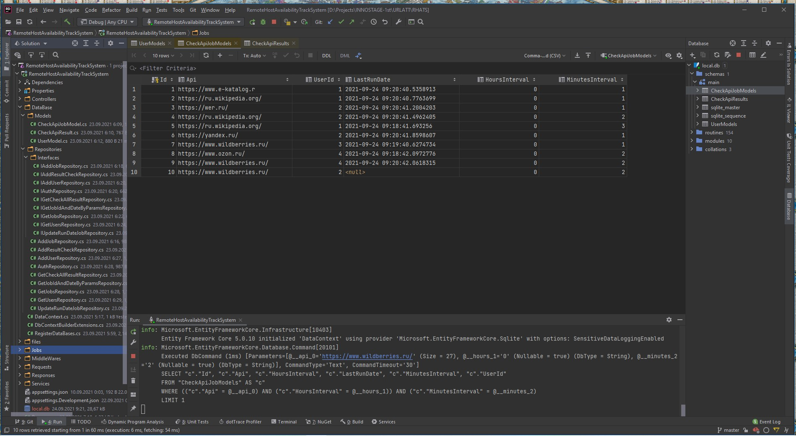
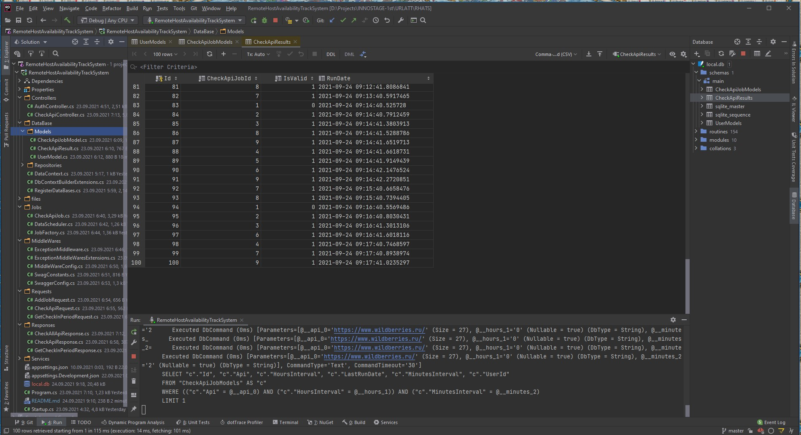

# how to run

1. From terminal enter: `dotnet run`

2. From the browser [click](http://localhost:8080/swagger/index.html) or `http://127.0.0.1:8080/swagger/index.html`

3. Enjoy:        

4. [Overview](files/localhost-8080-swagger-index-html..pdf)

5. Database-side
    

    

    

    

