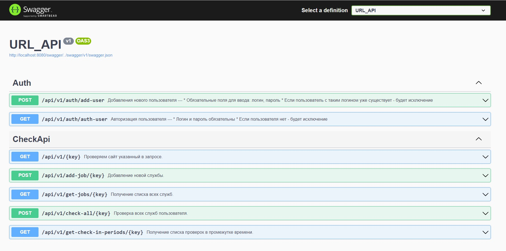

# how to run

1. From terminal enter: `dotnet run`

2. From the browser click: `http://localhost:8080/swagger/index.html`

3. Enjoy:        

4.[overview](files/localhost-8080-swagger-index-html..pdf)
